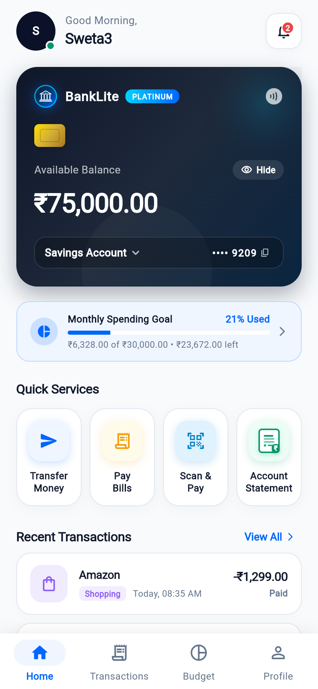
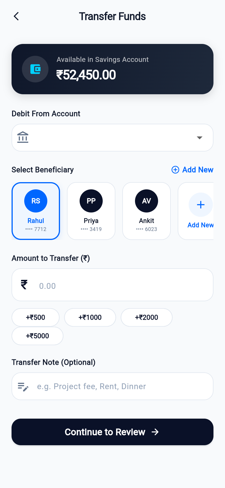
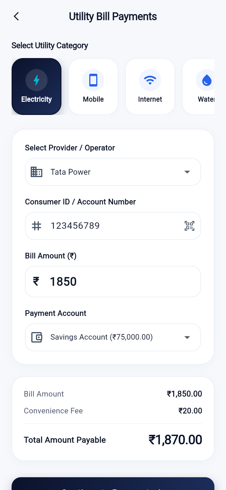
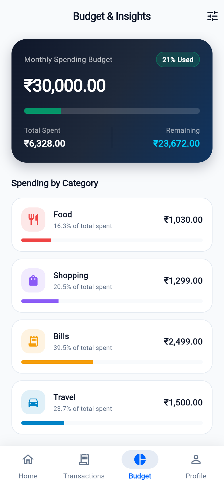
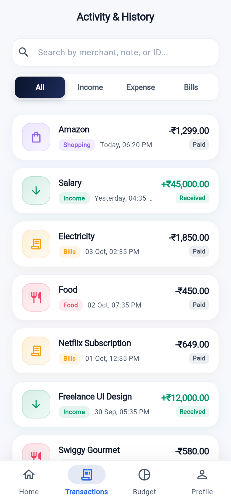
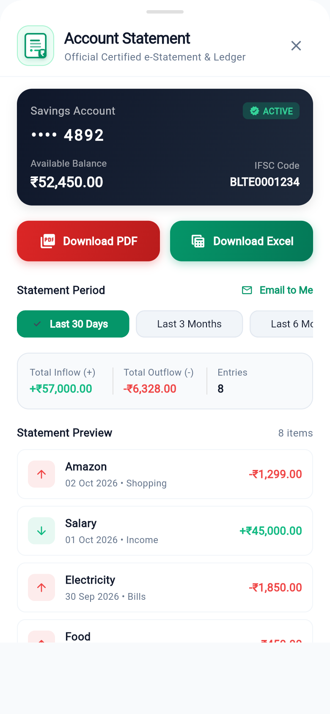
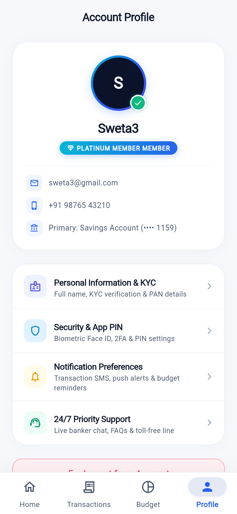
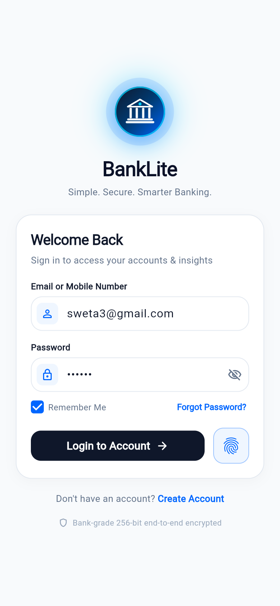

# 🏦 BankLite — Simple. Secure. Smarter Banking.

[](https://flutter.dev)
[](https://firebase.google.com)
[](https://www.figma.com/design/0ni6rdyIogiQTzIvoB65dM/banklite?node-id=0-1&t=tdvMffsIun8SiRXt-1)
[](LICENSE)

> A simplified Flutter banking app for transfers, bills, budgets & statements — powered by Firebase.

<p align="center">
  <a href="https://banklite-f95a6.web.app">
    
  </a>
  &nbsp;&nbsp;
  <a href="https://www.figma.com/design/0ni6rdyIogiQTzIvoB65dM/banklite?node-id=0-1&t=tdvMffsIun8SiRXt-1">
    
  </a>
</p>

---

## 📱 App Interface

### Core Banking Flow
| Home Dashboard | Transfer Funds | Pay Utility Bills | Budget Insights |
| :---: | :---: | :---: | :---: |
|  |  |  |  |

### Statements, Ledger & Security
| Activity & History | Account Statement | User Profile | Login & Biometrics |
| :---: | :---: | :---: | :---: |
|  |  |  |  |

---

## ✨ Features

| Feature | Details |
|---|---|
| 💳 **Clean Dashboard** | Dual-account switching, balance hide/show toggle, spending goal bar |
| 💸 **Fast Transfers** | Beneficiary carousel, quick amount chips (₹500–₹5000), instant validation |
| 💡 **Utility Bills** | Electricity, Mobile, Broadband, Water — with fee breakdown & ledger logging |
| 📊 **Budget Insights** | Category-wise spending bars (Food, Shopping, Bills, Travel) |
| 📄 **PDF & Excel Statements** | Certified e-statements with date filters, downloadable on-device |
| 🔍 **Searchable Ledger** | Filter by All / Income / Expense / Bills, live search by payee or reference ID |
| 🔐 **Security** | Firebase Auth, biometric unlock, 256-bit session, KYC badge |
| ☁️ **Firebase Firestore** | All data (accounts, transactions, bills, statements) stored per-user in cloud |

---

## 🛠️ Tech Stack

- **Frontend**: Flutter 3.29 (Dart 3.7) — cross-platform (iOS, Android, Web, macOS)
- **Backend**: Firebase Auth + Cloud Firestore (real-time, per-user data isolation)
- **Exports**: Client-side PDF & Excel (CSV) generation in Dart — no server needed
- **State**: `ChangeNotifier` + `InheritedWidget` with local `SharedPreferences` cache fallback

---

## 🚀 Run Locally

```bash
git clone https://github.com/Shweta-Tech-creator/banklite.git
cd banklite
flutter pub get
flutter run -d chrome   # Web
flutter run             # Mobile
```

> **Demo login**: `sweta3@gmail.com` / `123456` — or tap the **Biometric** button

---

## 🧪 Tests

```bash
flutter test
```

---

## 🎨 Figma Design

👉 **[Open BankLite on Figma](https://www.figma.com/design/0ni6rdyIogiQTzIvoB65dM/banklite?node-id=0-1&t=tdvMffsIun8SiRXt-1)**

---

## 📜 License

Released under the [MIT License](LICENSE).

